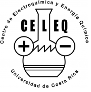

<!DOCTYPE html>
<html lang="en">
<head>
  <meta http-equiv="Content-Type" content="text/html; charset=UTF-8"/>
  <meta name="viewport" content="width=device-width, initial-scale=1, maximum-scale=1.0"/>
  <title>Karina Torres-Castro</title>

  <link href="https://fonts.googleapis.com/icon?family=Material+Icons" rel="stylesheet">
  <link rel="stylesheet" href="https://cdnjs.cloudflare.com/ajax/libs/materialize/1.0.0-beta/css/materialize.min.css" media="screen,projection">
  <link rel="stylesheet" href="https://cdn.rawgit.com/jpswalsh/academicons/master/css/academicons.min.css">
  

  

  <link rel="shortcut icon" type="image/x-icon" href="favicon.ico" />
  <meta name="theme-color" content="#007bb8">

</head>
<body>

  

    <h4>&nbsp;&nbsp;&nbsp;&nbsp;Karina Torres-Castro</h4>
  

  

  

  

  

    <!-- 

    
 -->
    

      <!-- <h6> -->
      <blockquote font-size="large">
        I am a Ph.D. student in the Charles L. Brown Department of Electrical and Computer Engineering <a href="https://engineering.virginia.edu/departments/electrical-and-computer-engineering"> of the University of Virginia</a> advised by Prof. <a href="https://engineering.virginia.edu/faculty/nathan-swami"> Nathan Swami</a>, working on Bio-Inspired Systems <a href="http://people.virginia.edu/~ns5h/"> at micro and nano-scale</a>. I received my B.S (Lic.) in Chemical Engineering at the <a href="https://www.ucr.ac.cr/"> Universidad de Costa Rica</a> and a M.S. in Micro-Electromechanical Systems (MEMS) at <a href="https://www.tec.ac.cr/"> Tecnológico de Costa Rica </a> Previously I spent 8 years working as a Engineer in the private and public sector.
      </blockquote>
      

        <a  href="mailto:kt2fe@virginia.edu"><i class="far fa-envelope fa-2x"></i></a>&nbsp;
        <a  href="https://www.linkedin.com/in/karina-torres-553ba687/"><i class="fab fa-linkedin-in fa-2x"></i></a>&nbsp;
        <a  href="https://twitter.com/Klariceorama"><i class="fab fa-twitter fa-2x"></i></a>&nbsp;
        <a  href="Karina_Torres-Castro_CV.pdf"><i class="far fa-file fa-2x"></i></a>&nbsp;&nbsp;&nbsp;&nbsp;&nbsp;
      

      <!-- </h6> -->
    

    

    

    

      <!-- class="responsive-img" -->
       
    

    <!-- 

    
 -->
  

  

  

    <h6><b>Publications</b></h6>
  

  

    <table class="highlight">
    <tbody>
      <tr style="border-bottom: 0;">
        <td style="vertical-align: top;"></td>
        <td><a href="https://link.springer.com/article/10.1007/s00216-020-02467-1">High-throughput dynamical analysis of dielectrophoretic frequency dispersion of single cells based on deflected flow streamlines</a>. 
        Karina Torres-Castro, Carlos Honrado, Walter B. Varhue, Vahid Farmehini & Nathan Swami. <b>Analytical and Bioanalytical Chemistry</b> (Selected in Forefront) 

        <td></td>
      </tr>
      <tr style="border-bottom: 0;">
        <td style="vertical-align: top;"></td>
        <td><a href="https://aip.scitation.org/doi/full/10.1063/1.5049148">Combined electrokinetic manipulations of pathogenic bacterial samples in low-cost fabricated dielectrophoretic devices</a>. 
        Alejandro Martinez-Brenes, Karina Torres-Castro, Richard Marin-Benavides, Katherine Acuña-Umaña, Christopher Espinoza-Araya et al. <b>AIP Advances</b>  

        <td></td>
      </tr>

    </tbody>
  </table>

  <!-- 

    

    

        <a href="https://arxiv.org/abs/2001.06001">Curriculum Labeling: Self-paced Pseudo-Labeling for Semi-Supervised Learning</a>. 
        Paola Cascante-Bonilla, Fuwen Tan, Yanjun Qi, Vicente Ordonez. 
        [<a href="https://arxiv.org/abs/2001.06001" target="_blank">arxiv</a>] [<a href="http://vicenteordonez.com/files/self-paced.txt" target="">bibtex</a>]
    

  
 -->

  <!-- 

    

    

        <a href="http://papers.neurips.cc/paper/8533-drill-down-interactive-retrieval-of-complex-scenes-using-natural-language-queries">Drill-down: Interactive Retrieval of Complex Scenes using Natural Language Queries</a>. 
        Fuwen Tan, Paola Cascante-Bonilla, Xiaoxiao Guo, Hui Wu, Song Feng, Vicente Ordonez. 
        Conf. on Neural Information Processing Systems. <b>NeurIPS 2019</b>. 
        Vancouver, Canada. December 2019. [<a href="https://arxiv.org/abs/1911.03826" target="_blank">arxiv</a>] [<a href="https://papers.nips.cc/paper/8533-drill-down-interactive-retrieval-of-complex-scenes-using-natural-language-queries/bibtex" target="">bibtex</a>]
    

  
 -->

  <!-- 

    

    

        <a href="http://www.cs.virginia.edu/~pc9za/research/moviescope.html" target="_blank">Moviescope: Large-scale Analysis of Movies using Multiple Modalities</a>. 
        Paola Cascante-Bonilla,  Kalpathy Sitaraman, Mengjia Luo, Vicente Ordonez. 
        [<a href="https://arxiv.org/abs/1908.03180" target="_blank">arxiv</a>] [<a href="http://www.cs.virginia.edu/~pc9za/research/moviescope.html" target="_blank">project page</a>] [<a href="https://techxplore.com/news/2019-08-features-movie-genre.html?fbclid=IwAR1oJnZw5WxkcDfaIMOmxZ4Oj9xyuXbkybQhep-aJgcTrRRNwYcooVSGOsA" target="_blank">techxplore article</a>]
    

  
 -->

  <!-- 

    

    

      <a href="https://www.aclweb.org/anthology/papers/N/N19/N19-4024/" target="_blank">Chat-crowd: A Dialog-based Platform for Visual Layout Composition.</a> 
        Paola Cascante-Bonilla, Xuwang Yin, Vicente Ordonez, Song Feng. 
        North American Chapter of the Association for Computational Linguistics. <b>NAACL 2019</b>. System Demonstrations. 
        Minneapolis, Minnesota. June 2019. [<a href="https://arxiv.org/abs/1812.04081" target="_blank">arxiv</a>] [<a href="https://chatcrowd.github.io/" target="_blank">project page</a>] [<a href="https://github.com/uvavision/chat-crowd" target="_blank">code</a>] [<a href="https://www.aclweb.org/anthology/papers/N/N19/N19-4024.bib" target="_blank">bibtex</a>]
    

  
 -->

  

  

    <h6><b>Awards</b></h6>
  

  

    <table class="highlight">
      

        
Sture G. Olsson Fellowship in Engineering (2020).

        
iRedefine Grant Award - NSF Career Development Workshop (2020).

        
Outstanding Graduate Teaching Assistant Award (2018).

      

  </table>

  

  

    <h6><b>Teaching</b></h6>
  

  

    
TA: Microfabrication Laboratory     2017-2018.

    
TA: Fundamentals of Electronics I - Fall 2016.

  

    

  

  

    <h6><b>Work Experience</b></h6>
  

  

    <!-- 

 -->
    

      
    

    

      IguanaSolar 
      Solar Energy Consultant. 
      Mar 2013 - Jun 2016.
    

  

  

    <!-- 

 -->
    

      
    

    

      <a href="https://vinv.ucr.ac.cr/es/unidades/centro-de-investigacion-en-electroquimica-y-energia-quimica-celeq" target="_blank">CELEQ-UCR.</a> 
      R&D Engineer . 
      Mar 2011 - Feb 2015.
    

  

  

    <!-- 

 -->
    

      
    

    

      <a href="https://www.firestoneip.com/" target="_blank">Firestone Industrial Products.</a> 
      Process Engineer. 
      Jun 2009 - Feb 2011.
    

  

  

    <!-- 

 -->
    

      
    

    

      <a href="http://www.adastrarocket.com/aarc/" target="_blank">Ad Astra Rocket Company.</a> 
      Intern. 
      Jan 2009 - May 2009.
    

    

  

  <!--  Scripts-->
  
  

  </body>
</html>
